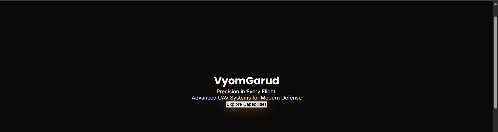
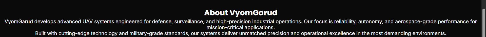
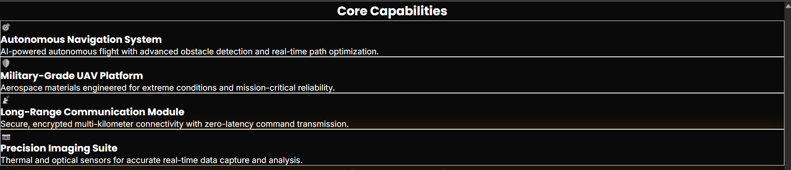
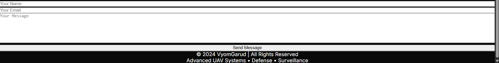

# 🚀 VyomGarud - Advanced UAV Systems

A modern, military-grade landing page for VyomGarud, showcasing advanced UAV/drone systems for defense and surveillance operations.

## 🎯 Project Overview

VyomGarud is a single-page landing page built with Next.js and Tailwind CSS, featuring a dark, futuristic design that reflects the precision and engineering excellence of military-grade UAV systems.

## 🛠️ Tech Stack

- **Framework**: Next.js 15
- **Styling**: Tailwind CSS
- **Fonts**: Poppins, Inter, Montserrat
- **Color Palette**: 
  - Background: Charcoal/Black (#0a0a0a)
  - Text: White (#ffffff)
  - Accent: Orange (#ff7b00)

## 📦 Installation

1. Clone the repository:
```bash
git clone <your-repo-url>
cd vyomgarud-landing
```

2. Install dependencies:
```bash
npm install
```

3. Run the development server:
```bash
npm run dev
```

4. Open [http://localhost:3000](http://localhost:3000) in your browser.

## 🏗️ Project Structure

```
/app
  layout.js          # Root layout with metadata
  page.js            # Main page component
  globals.css        # Global styles and fonts
/components
  Hero.jsx           # Hero section with CTA
  About.jsx          # Company mission statement
  Capabilities.jsx   # Product/service cards
  Highlights.jsx     # Key features section
  Contact.jsx        # Contact form and footer
/screenshots         # Project screenshots
```

## ✨ Features

### 1. Hero Section
- Full-screen layout with animated grid background
- Company branding with orange accent
- Clear call-to-action button
- Smooth scroll indicator

### 2. About Section
- Mission statement
- Clean, centered layout
- Orange accent underline

### 3. Capabilities Section
- 4 product/service cards:
  - Autonomous Navigation System
  - Military-Grade UAV Platform
  - Long-Range Communication Module
  - Precision Imaging Suite
- Hover effects with orange glow
- Responsive grid layout

### 4. Highlights Section
- 3 key features:
  - High Reliability
  - Advanced Autonomy
  - Precision Engineering
- Horizontal layout (desktop) / Vertical (mobile)

### 5. Contact & Footer
- Simple contact form (name, email, message)
- Form validation
- Copyright footer

## 🎨 Design Principles

- **Dark Theme**: Black/charcoal background for military aesthetic
- **Bold Typography**: Poppins for headings, Inter for body
- **Orange Accents**: Strategic use of #ff7b00 for CTAs and highlights
- **Subtle Animations**: Professional hover effects and transitions
- **Generous Spacing**: Clean, uncluttered layout
- **Responsive Design**: Mobile-first approach

## 📸 Screenshots

### Hero Section


### About Section


### Capabilities Section


### Highlights Section


### Contact & Footer


### Mobile Responsive


## 🚀 Build for Production

```bash
npm run build
npm start
```

## 📝 Design Inspiration

- [Onomondo](https://onomondo.com/)
- [Raphe](https://www.raphe.com/)

## 📄 License

All Rights Reserved © 2024 VyomGarud

---

**Built with precision. Engineered for excellence.**
